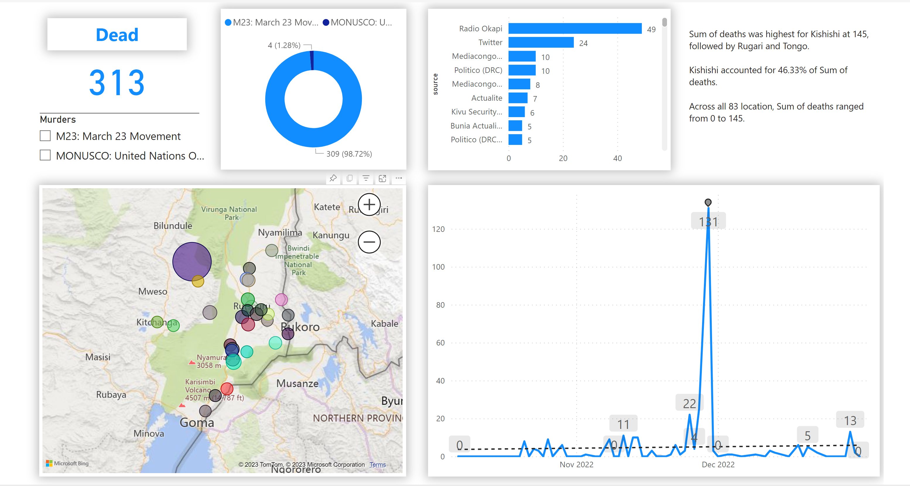
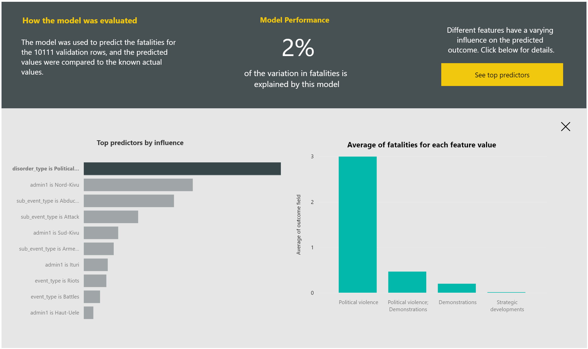

# RDC-conflict
The Democratic Republic of Congo (DRC) has been plagued by violence for almost 30 years. Civil wars, local disputes and cross-border conflicts have resulted in millions of deaths and the displacement of an estimated 5.6 million people.

Several factors have been identified as contributing to the ongoing conflict in the country’s volatile east. These include ethnic tensions, illegal exploitation of natural resources and a ruling elite that profits from the chaos.

Much of the current violence is concentrated in Ituri, North Kivu and South Kivu provinces along DRC’s eastern border.
# Visualization rebels of M23 
This visual shows how the M23 rebels movement launched a series of attacks against the FARDC positions in North Kivu province between October 2022 and December 2022, causing many civilian casualties. The M23 rebels were former members of the FARDC who defected over grievances related to their integration and treatment . They were also accused of receiving support from Rwanda, which denied any involvement 12. The visual indicates that Kishishi was the most affected location by the violence, with `145 deaths`, followed by `Rugari` and `Tongo`. `Kishishi` alone accounted for 46.33% of all deaths across 83 locations. The number of deaths varied from 0 to 145 in different locations, reflecting the intensity and spread of the conflict. With implication of `Monusco` at  this period 4 civilian died.
Within this visualization you can see that `Radio Okapi`is the top of media that informe people about situation on DRC conflict.
.
##

## Model Performance
In model model performance, During our analysis, we used Machine Learning with Power BI services to conduct an in-depth examination of death data from fields  in data sources. By leveraging the capabilities of Automated Machine Learning (AutoML) in Power BI Services, we were able to extract relevant features and build a model that best fits the data. Our findings indicate that political violence has a significant impact on the number of deaths, with an average of 2.99 deaths predicted after we have Nord-Kivu which have an influence of dead people.
##

## Action to stop M23 rebels
M23 rebels have largely been defeated and disarmed since 2013, when they were pushed out of their stronghold in the eastern city of Goma by the Congolese army with support from UN peacekeepers. However, if M23 or any other armed group were to resurge in the future, there are several steps that could be taken to remove them:

1. Deploy military forces: The Congolese army, with support from UN peacekeeping forces, could be deployed to areas where M23 or other armed groups are operating in order to remove them. Military action should be carefully planned and targeted to avoid civilian casualties and minimize the risk of retaliation by the rebels.

2. Pursue negotiations: Diplomatic efforts could be made to pursue negotiations with the rebels, offering them the opportunity to disarm and reintegrate into society. This approach has been successful in some previous conflicts in the DRC, such as the peace agreement reached with the M23 rebels in 2009.

3. Engage with regional and international partners: Regional and international partners can play a key role in supporting efforts to remove armed groups from the DRC. The UN, the African Union, and neighboring countries can provide support for military operations, diplomatic efforts, and humanitarian assistance.

4. Promote accountability for human rights abuses: Armed groups in the DRC have been responsible for numerous human rights abuses, including rape, forced displacement, and extrajudicial killings. Holding perpetrators accountable for these crimes can help to prevent future abuses and reduce the appeal of armed groups. Efforts to promote justice and accountability can be pursued through national and international courts, as well as through truth and reconciliation processes.
##
## Power BI files 
(https://app.powerbi.com/view?r=eyJrIjoiYjI4ZDg3NWEtZWJhNS00MTgxLWI0OGMtZDk4N2Y5OTQ5ZDlmIiwidCI6ImQyMzViNDFjLTVlZTktNGM2MC1iY2ZmLWQ2OGZlM2JmZjZhMCIsImMiOjN9)
